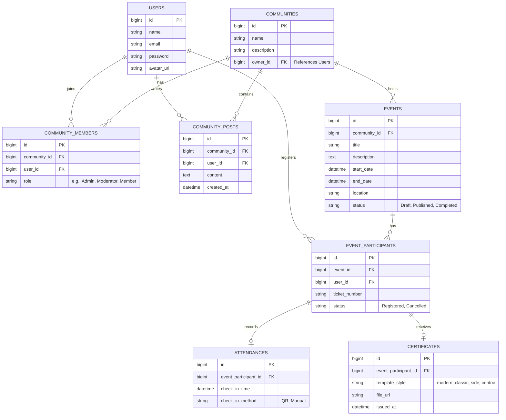

# PETA (Tech Events Platform) - Backend Development Overview

Berdasarkan *User Interface* (UI) dan komponen yang telah kita rancang selama ini, aplikasi PETA membutuhkan struktur data yang saling berelasi (komunitas, acara, peserta) dan sekumpulan API/Controller untuk menggerakkan seluruh fungsi interaktif tersebut.

Berikut adalah gambaran sistem *backend* (ERD dan Endpoint API) yang perlu dikembangkan di Laravel.

---

## 1. Entity Relationship Diagram (ERD)

Desain *database* inti untuk mengakomodasi seluruh fitur dari Dashboard hingga Analytics.

---

## 2. Kebutuhan API & Controllers (Roadmap)

Di bawah ini adalah daftar *Controllers* (atau API Endpoints) yang harus Anda kembangkan di Laravel untuk menghubungkan desain UI dengan *Database*.

### 🏢 1. Community & Workspace Management (`CommunityController`)
*Fitur: Topbar Switcher, Halaman Community (Feed, Roles).*
- `GET /communities` : Mengambil daftar komunitas user untuk *dropdown switcher*.
- `POST /communities` : Membuat komunitas/workspace baru.
- `GET /communities/{id}/feed` : Mengambil data pos/pengumuman untuk halaman komunitas.
- `POST /communities/{id}/feed` : Mengirim pos/pengumuman baru.
- `POST /communities/{id}/roles` : Menyimpan pengaturan role/jabatan (dari *Role Builder Modal*).

### 📅 2. Event Management (`EventController`)
*Fitur: Halaman Events, Event Detail, Dashboard Stats.*
- `GET /events` : Menampilkan daftar event dalam bentuk *grid/card*.
- `POST /events` : Menyimpan data *event* baru (dari tombol "Add New Event").
- `GET /events/{id}` : Mengambil detail *event* tunggal (untuk halaman `EventDetail`).
- `PUT /events/{id}` : Mengedit detail *event* (lokasi, waktu, deskripsi).
- `DELETE /events/{id}` : Menghapus/membatalkan *event*.

### 👥 3. Participant Management (`ParticipantController`)
*Fitur: Halaman Participants, Export Data.*
- `GET /events/{id}/participants` : Mengambil daftar peserta suatu acara (lengkap dengan fitur *search/filter*).
- `POST /events/{id}/participants` : Menambahkan peserta baru secara manual.
- `GET /events/{id}/participants/export` : Mengunduh data peserta dalam format CSV/Excel.

### 📋 4. Attendance & Check-in (`AttendanceController`)
*Fitur: Halaman Attendance, Check-in log.*
- `GET /events/{id}/attendance` : Melihat persentase dan daftar peserta yang sudah/belum hadir.
- `POST /attendance/check-in` : Memproses validasi QR Code atau tombol *manual check-in*.

### 🎓 5. Certificate Engine (`CertificateController`)
*Fitur: Halaman Certificates, Live Preview Templating.*
- `GET /certificates/templates` : Mendapatkan daftar dan aset template sertifikat.
- `POST /certificates/generate` : Memproses pembuatan sertifikat untuk seluruh peserta yang telah hadir (*Batch processing*).
- `GET /certificates/{id}/download` : Menghasilkan *output* PDF untuk diunduh.

### 📊 6. Analytics & Reports (`AnalyticsController`)
*Fitur: Halaman Analytics, Chart Data, Export Report Modal.*
- `GET /analytics/dashboard` : Mengirim struktur data JSON untuk merender grafik *Chart.js* (Monthly Events, Attendance Trends).
- `POST /analytics/export` : Men- *generate* laporan komprehensif dalam PDF/CSV berdasarkan *checkbox* opsi yang dipilih dari modul *Export Report*.

### ⚙️ 7. Auth & Settings (`ProfileController` & `AuthController`)
*Fitur: Halaman Settings (Profile, Security, Notifications).*
- `PUT /profile/update` : Memperbarui identitas pengguna (nama, email, avatar).
- `PUT /profile/security` : Memperbarui *password* dan memvalidasi konfigurasi otentikasi dua faktor (2FA).
- `PUT /profile/notifications` : Menyimpan preferensi *email* notifikasi (Push/Email toggles).

---

## Saran Eksekusi (Best Practices)
1. Karena menggunakan *Blade*, Anda bisa me- *return view* langsung dari controller (contoh: `return view('Pages.Analytics', $data)`), bukan berupa JSON API murni, kecuali untuk bagian grafik *Chart.js* atau *modal submission* (jika menggunakan *Fetch/Axios*).
2. Manfaatkan **Laravel Eloquent Relationships** (misal: `$event->participants()`) agar kode di *Controller* menjadi ringkas berdasarkan relasi tabel di ERD.
